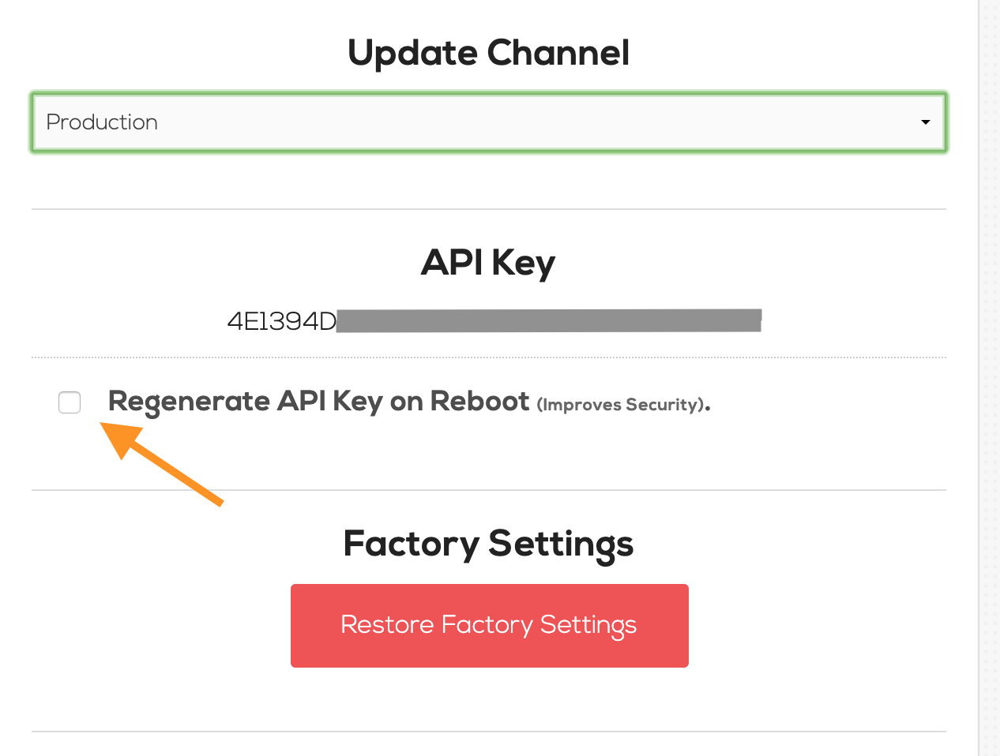
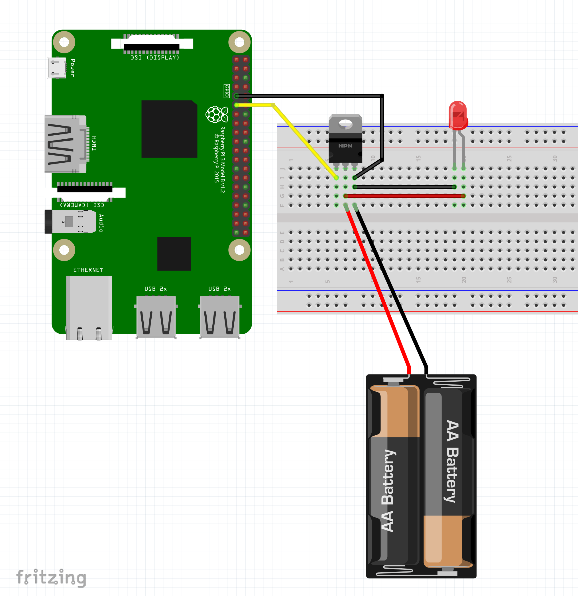

# Turn a light on with a raspberry pi when a print job starts


## Enable ssh on astrobox

SSH must be enabled on the astrobox. The easiest way to enable it is:

- Power off astrobox
- Remove SD card
- Plug SD card into a computer
- Create '/ssh' text file in root of card
- Plug SD card back into raspberry pi

```
cd /Volumes/boot
touch ssh
```

You should now be able to ssh into the pi (password is 'raspberry')

```
ssh pi@192.168.1.99
```


## Disable automatic API key rotation on reboot

- Go to the astrobox gui
- Navigate to 'Settings' -> 'Advanced'
- Unckeck "Regenerate API Key on Reboot"



## Electronics

Setup a `IRLZ34N` MOSFET and connect it to pin 17 on the raspberry pi (6th pin down)



## Installation

### Easy Installation

```
ssh pi@<astrobox IP address>
sudo su -
curl -s https://raw.githubusercontent.com/spuder/astrobox-lights/master/install.sh | bash
```

Once installed, check the service is working properly

```
service lights status
journalctl -u lights
```

### Manual Insatallation

See `install.sh`


## Troubleshooting

To troubleshoot look at the systemd logs.
To exit, type `ctrl + c`

```
journalctl -u lights -f
```

## Resources


