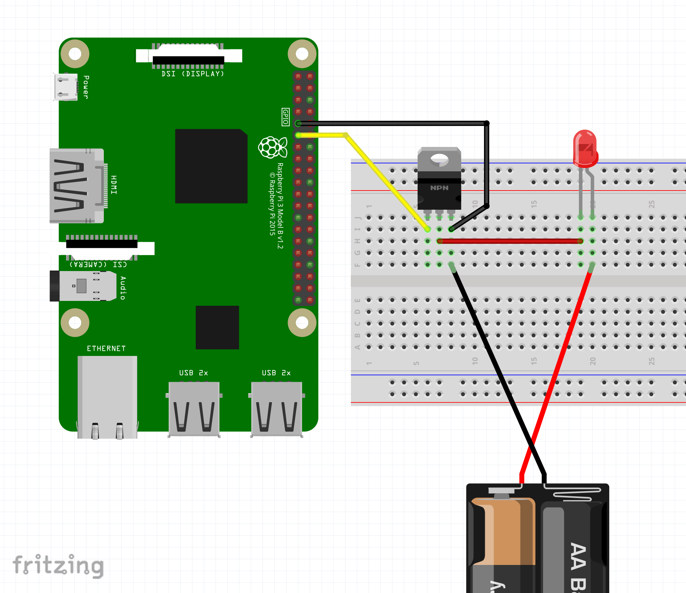

# Turn a light on with a raspberry pi when a print job starts

Astrobox does not have a mechanism to control GPIO pins on a raspbery pi. 
This functionality would be great for controlling LED lights on a heat bed. 

This script will poll `localhost/api/job` api endpoint once per second.
If the api returns that a print job is in progress, it will turn on GPIO pin 17
on the raspberry pi. If a print job is in any other state, it will turn the GIPO pin off

This script is entirely written in bash, so no need to worry about python libraries or
future python updates breaking this automation.

To use you must:

- Build small circuit with mostfet to protect the 3.3v PI from 12v voltages  
- Enable ssh on raspberry pi  
- Disable API key rotation  
- Deploy script  
- Profit? 

## Parts

- LED Connector: (Optional)  
  - https://www.amazon.com/gp/product/B072BXB2Y8/ref=ppx_yo_dt_b_asin_title_o00_s00?ie=UTF8&psc=1
- IRLZ34N Mostfet: (Need only 1)  
  - https://www.amazon.com/10PCS-IRLZ34N-IRLZ34NPBF-TO220-IRLZ34/dp/B07L87YC8H/ref=sr_1_4?keywords=IRLZ34N&qid=1582526965&s=electronics&sr=1-4-catcorr (untested)
  - https://www.amazon.com/Onyehn-Mosfet-Button-Arduino-Raspberry/dp/B07GLNCRR4/ref=sr_1_3?keywords=led+mosfet&qid=1582527176&sr=8-3 (no soldering needed, untested)
- 12 V Leds: (Assuming your printer runs on 12v)  
  - https://www.amazon.com/gp/product/B007JF2A6G/ref=ppx_yo_dt_b_asin_title_o01_s00?ie=UTF8&psc=1

## Enable ssh on astrobox

SSH must be enabled on the astrobox. The easiest way to enable it is:

- Power off astrobox
- Remove SD card
- Plug SD card into a computer
- Create '/ssh' text file in root of card
- Plug SD card back into raspberry pi

```
cd /Volumes/boot
touch ssh
```

You should now be able to ssh into the pi (password is 'raspberry'). 
Windows users will need to use a tool like ['putty'](https://www.putty.org/)

```
ssh pi@192.168.1.99
```


## Disable automatic API key rotation on reboot

- Go to the astrobox gui
- Navigate to 'Settings' -> 'Advanced'
- Unckeck "Regenerate API Key on Reboot"


## Electronics

Setup a `IRLZ34N` MOSFET and connect it to pin 17 on the raspberry pi (6th pin down)



## Installation

### Easy Installation

```
ssh pi@<astrobox IP address>
sudo su -
curl -s https://raw.githubusercontent.com/spuder/astrobox-lights/master/install.sh | bash
```

Once installed, check the service is working properly

```
service lights status
journalctl -u lights
```

### Manual Insatallation

See `install.sh`


### Uninstalling

```
sudo su -
service lights stop
rm -rf /etc/systemd/system/lights.service
rm -rf /etc/astrobox-lights
```

## Troubleshooting

To troubleshoot look at the systemd logs.
To exit, type `ctrl + c`

```
journalctl -u lights -f
```

## Misc

- How many LED's can this mosfet support? 

The more load you put on the mosfet, the hotter it will get. I've succesfully tested 1 meter of LED's pulling 0.4 amps. The mostfet was not hot to the touch. 
Your results may vary. Use at your own risk

## Resources

- [](https://dordnung.de/raspberrypi-ledstrip/)  
- [](https://raspberrypi-aa.github.io/session2/bash.html)  
- [](https://medium.com/coinmonks/controlling-raspberry-pi-gpio-pins-from-bash-scripts-traffic-lights-7ea0057c6a90)  
